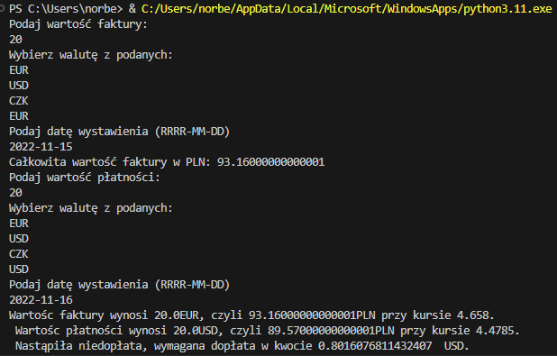

# Raport Program do Obliczania Różnic Kursowych

## Wprowadzenie
Program ma za zadanie komunikowanie się z API Narodowego Banku Polskiego i na podstawie wprowadzonych danych o fakturze oraz płatności obliczyć kurs oraz prawidłowość przeprowadzonej płatności.

## Raport z przebiegu zadania
### Uruchomienie programu i analiza wyników:
Program po uruchomieniu zarządca od użytkownika wprowadzenia 3 podstawowych danych o fakturze a są to:
- wartość faktury,
- jedna z 3 obsługiwanych walut,
- data wystawienia faktury w formacie RRRR-MM-DD.
Następnie podajemy te same 3 dane dla płatności za fakturę.
Program w tym momencie porówuje płatność z fakturą i wyświetla nam informację na podstawie kursów o tym czy płatność została zrobiona w całości czy mamy nadpłatę lub niedopłatę.
Wszystkie wprowadzone oraz pobrane dane są zapisywane w pliku .txt w celu tworzenia archiwum płatności.

### Kod źródłowy
```python
#importy wymaganych bibliotek
import requests
import csv
import datetime

while True:
    # wprowadzenie danych faktur 
    while True:
        try:
            invoice_value = float(input("Podaj wartość faktury:\n"))
            break
        except ValueError:
            print("[BŁĄD] Proszę podać wartość w formacie liczbowym")

    while True:
        invoice_currency = input("Wybierz walutę z podanych:\nEUR\nUSD\nCZK\n")
        if invoice_currency == "EUR" or invoice_currency == "USD" or invoice_currency == "CZK":
            break
        else:
            continue

    while True:
        while True:
            try:
                invoice_date = input("Podaj datę wystawienia (RRRR-MM-DD)\n")
                datetime.date.fromisoformat(invoice_date)
                break
            except ValueError:
                print("[BŁĄD] Nieprawidłowy format danych, proszę podać datę w formacie RRRR-MM-DD")
        try:
            # komunikacja z API
            communication = requests.get(f'http://api.nbp.pl/api/exchangerates/rates/c/{invoice_currency}/{invoice_date}/?format=json')
            response = communication.json()
            invoice_exchange_rate = response['rates'][0]['bid']
            invoice_value_in_PLN = invoice_value * invoice_exchange_rate

            invoice = [invoice_value, invoice_currency, invoice_exchange_rate, invoice_value_in_PLN, invoice_date]
            
            # zapis faktur do pliku txt
            with open('invoices.txt', 'a', encoding='UTF8') as invoices_file:
                writer = csv.writer(invoices_file)
                writer.writerow(str(invoice))
                invoices_file.close()
            break
        except ValueError:
            print("[BŁĄD] Brak kursu walut dla danego dnia, proszę wprowadzić inną datę.")

    print(f'Całkowita wartość faktury w PLN: {invoice_value_in_PLN}')

    # wprowadzenie danych płatności
    while True:
        try:
            payment_value = float(input("Podaj wartość płatności:\n"))
            break
        except ValueError:
            print("[BŁĄD] Proszę podać wartość w formacie liczbowym")

    while True:
        payment_currency = input("Wybierz walutę z podanych:\nEUR\nUSD\nCZK\n")
        if payment_currency == "EUR" or payment_currency == "USD" or payment_currency == "CZK":
            break
        else:
            continue

    while True:
        while True:
            try:
                payment_date = input("Podaj datę wystawienia (RRRR-MM-DD)\n")
                datetime.date.fromisoformat(payment_date)
                break
            except ValueError:
                print("[BŁĄD] Nieprawidłowy format danych, proszę podać datę w formacie RRRR-MM-DD")
        try:
            # komunikacja z API
            communication = requests.get(f'http://api.nbp.pl/api/exchangerates/rates/c/{payment_currency}/{payment_date}/?format=json')
            response = communication.json()
            payment_exchange_rate = response['rates'][0]['bid']
            payment_value_in_PLN = payment_value * payment_exchange_rate

            payment = [payment_value, payment_currency, payment_exchange_rate, payment_value_in_PLN, payment_date]

            # zapis metody płatności do pliku txt
            with open('payments.txt', 'a', encoding='UTF8') as payment_file:
                writer = csv.writer(payment_file)
                writer.writerow(payment)
                payment_file.close()
            break
        except ValueError:
            print("[BŁĄD] Brak kursu walut dla danego dnia, proszę wprowadzić inną datę.")

    # wyświetlenie w terminalu informacji o płatnościach faktury
    if invoice_value_in_PLN == payment_value_in_PLN:
        print(f"Wartośc faktury wynosi {invoice_value}{invoice_currency}, czyli {invoice_value_in_PLN}PLN przy kursie {invoice_exchange_rate}.\n Wartośc płatności wynosi {payment_value}{payment_currency}, czyli {payment_value_in_PLN}PLN przy kursie {payment_exchange_rate}.\n Faktura została opłacona w całośCi.")
    elif invoice_value_in_PLN < payment_value_in_PLN:
        print(f"Wartośc faktury wynosi {invoice_value}{invoice_currency}, czyli {invoice_value_in_PLN}PLN przy kursie {invoice_exchange_rate}.\n Wartośc płatności wynosi {payment_value}{payment_currency}, czyli {payment_value_in_PLN}PLN przy kursie {payment_exchange_rate}.\n Nastąpiła nadpłata, wymagany zwrot w kwocie", (float(payment_value_in_PLN) - float(invoice_value_in_PLN)) / (payment_exchange_rate),f" {payment_currency}.")
    else:
        print(f"Wartośc faktury wynosi {invoice_value}{invoice_currency}, czyli {invoice_value_in_PLN}PLN przy kursie {invoice_exchange_rate}.\n Wartośc płatności wynosi {payment_value}{payment_currency}, czyli {payment_value_in_PLN}PLN przy kursie {payment_exchange_rate}.\n Nastąpiła niedopłata, wymagana dopłata w kwocie", (float(invoice_value_in_PLN) - float(payment_value_in_PLN)) / (payment_exchange_rate),f" {payment_currency}.")
```

#### Połaczenie z API NBP
Aby połączyć się z API NBP użyłem filmiku na YouTUbe https://www.youtube.com/watch?v=C3jaMFh9Ut0.
Pierwszym krokiem było zainstalowanie/aktualizacja pakieru PiP komendą Pip install requests w konsoli.
PiP jest oficjalnym oraz domyślnym system zarządzania pakietami dla środowiska języka Python.
Następnie użyłem linku https://api.nbp.pl/api/exchangerates/tables/a/?format=json aby sprawdzić dane z API NBP w fomacie json.
Aby API mogło działać musimy zaimportować biblioteki ```python import requests```.

#### Dane faktur
```python
# wprowadzenie danych faktur 
    while True:
        try:
            invoice_value = float(input("Podaj wartość faktury:\n"))
            break
        except ValueError:
            print("[BŁĄD] Proszę podać wartość w formacie liczbowym")

    while True:
        invoice_currency = input("Wybierz walutę z podanych:\nEUR\nUSD\nCZK\n")
        if invoice_currency == "EUR" or invoice_currency == "USD" or invoice_currency == "CZK":
            break
        else:
            continue

    while True:
        while True:
            try:
                invoice_date = input("Podaj datę wystawienia (RRRR-MM-DD)\n")
                datetime.date.fromisoformat(invoice_date)
                break
            except ValueError:
                print("[BŁĄD] Nieprawidłowy format danych, proszę podać datę w formacie RRRR-MM-DD")
        try:
            # komunikacja z API
            communication = requests.get(f'http://api.nbp.pl/api/exchangerates/rates/c/{invoice_currency}/{invoice_date}/?format=json')
            response = communication.json()
            invoice_exchange_rate = response['rates'][0]['bid']
            invoice_value_in_PLN = invoice_value * invoice_exchange_rate

            invoice = [invoice_value, invoice_currency, invoice_exchange_rate, invoice_value_in_PLN, invoice_date]
            
            # zapis faktur do pliku txt

        except ValueError:
            print("[BŁĄD] Brak kursu walut dla danego dnia, proszę wprowadzić inną datę.")
```
W tym fragmencie kody pobieramy od użytkownika wartość faktury, jej walutę oraz datę wystawienia.
Następnie wszystkie wartości przypisujemy do odpowiadających im zmiennych.
Po wybraniu waluty oraz daty program komunikuję się z API NBP w celu ustalenia kursu na dany dzień.
Ostatnim krokiem jest zadeklarowanie listy ze zmiennymi którę chcemy zapisać do pliku.
W czasie wprowadzania danych są wprowadzone weryfikacje wprowadzonych danych.
W przypadku błędnych danch program prosi o ich ponowne podanie z praidłową datą.

#### Dane płatności
```python
while True:
        try:
            payment_value = float(input("Podaj wartość płatności:\n"))
            break
        except ValueError:
            print("[BŁĄD] Proszę podać wartość w formacie liczbowym")

    while True:
        payment_currency = input("Wybierz walutę z podanych:\nEUR\nUSD\nCZK\n")
        if payment_currency == "EUR" or payment_currency == "USD" or payment_currency == "CZK":
            break
        else:
            continue

    while True:
        while True:
            try:
                payment_date = input("Podaj datę wystawienia (RRRR-MM-DD)\n")
                datetime.date.fromisoformat(payment_date)
                break
            except ValueError:
                print("[BŁĄD] Nieprawidłowy format danych, proszę podać datę w formacie RRRR-MM-DD")
        try:
            # komunikacja z API
            communication = requests.get(f'http://api.nbp.pl/api/exchangerates/rates/c/{payment_currency}/{payment_date}/?format=json')
            response = communication.json()
            payment_exchange_rate = response['rates'][0]['bid']
            payment_value_in_PLN = payment_value * payment_exchange_rate

            payment = [payment_value, payment_currency, payment_exchange_rate, payment_value_in_PLN, payment_date]

            # zapis metody płatności do pliku txt

            break
        except ValueError:
            print("[BŁĄD] Brak kursu walut dla danego dnia, proszę wprowadzić inną datę.")
```
Pobieranie danych płatności jest działa tak samo jak pobieranie danych faktury.

#### Zapis faktur do pliku
```python
import csv

with open('invoices.txt', 'a', encoding='UTF8') as invoices_file:
    writer = csv.writer(invoices_file)
    writer.writerow(invoice)
    invoices_file.close()
```
Aby móc zapisywać do pliku najpierw importujemy biblioteki csv.
Następnie otwieramy plik 'invoices.txt' w trybie dodawania danych używając kodowania UTF8.
Później tworzymy obiekt pisarza (writer) klasy csv, który będzie odpowiedzialny za zapisanie danych w formacie CSV.
Kolejna linia kodu zapisuje jedną linijkę danych zmienną 'invoice' do pliku CSV.
Na końcu, plik zostaje zamknięty.

#### Zapis metody płatności do pliku
```python
import csv

with open('payments.txt', 'a', encoding='UTF8') as payment_file:
    writer = csv.writer(payment_file)
    writer.writerow(payment)
    payment_file.close()
```
Zapisywanie danych płatności jest identyczne jak przy zapisywaniu danych faktury.

#### Wyświetlenie w terminalu informacji o statusie faktury
```python
 if invoice_value_in_PLN == payment_value_in_PLN:
        print(f"Wartośc faktury wynosi {invoice_value}{invoice_currency}, czyli {invoice_value_in_PLN}PLN przy kursie {invoice_exchange_rate}.\n Wartośc płatności wynosi {payment_value}{payment_currency}, czyli {payment_value_in_PLN}PLN przy kursie {payment_exchange_rate}.\n Faktura została opłacona w całośCi.")
    elif invoice_value_in_PLN < payment_value_in_PLN:
        print(f"Wartośc faktury wynosi {invoice_value}{invoice_currency}, czyli {invoice_value_in_PLN}PLN przy kursie {invoice_exchange_rate}.\n Wartośc płatności wynosi {payment_value}{payment_currency}, czyli {payment_value_in_PLN}PLN przy kursie {payment_exchange_rate}.\n Nastąpiła nadpłata, wymagany zwrot w kwocie", (float(payment_value_in_PLN) - float(invoice_value_in_PLN)) / (payment_exchange_rate),f" {payment_currency}.")
    else:
        print(f"Wartośc faktury wynosi {invoice_value}{invoice_currency}, czyli {invoice_value_in_PLN}PLN przy kursie {invoice_exchange_rate}.\n Wartośc płatności wynosi {payment_value}{payment_currency}, czyli {payment_value_in_PLN}PLN przy kursie {payment_exchange_rate}.\n Nastąpiła niedopłata, wymagana dopłata w kwocie", (float(invoice_value_in_PLN) - float(payment_value_in_PLN)) / (payment_exchange_rate),f" {payment_currency}.")
```
Porównanie danych faktury oraz płatności i wyświetlenie informacji do użytkownika czy faktura została opłacona w całości, czy mamy nadpłatę lub czy mamy niedopłatę.

## Załączniki
- ****:

---

> Raport przygotowany przez: Norbert Gotfryd
> Data: XX.01.2024
